# 🐊 NLP Project: `coccodrillo`

## Description

**Coccodrillo** is an intelligent natural language assistant. It is capable of interpreting complex requests regarding travel, weather, restaurants, events, safety, and much more. It uses advanced NLP models to understand user intents, extract relevant entities, correct errors, and generate structured responses.

---

## 🎯 Supported Intents

The system recognizes 8 main intents:

0. 📍 **Safety updates for a location** – _"Is it safe?"_
   - Sources: [Bing News](https://www.bing.com/news/search?) + [Viaggiare Sicuri](https://www.viaggiaresicuri.it)
   
1. 🌪️ **Weather alerts and extreme weather conditions**
   - Sources: [Bing News](https://www.bing.com/news/search?)
   
2. 🗺️ **Recommended places to visit**
   - Data: Dataset downloaded from [Lonely Planet](https://www.lonelyplanet.com/), with the help of Python scripts based on Selenium and BeautifulSoup.
   - Integration: Uses Google Maps to check the availability of locations (for example, to know if a place is temporarily closed).
   
3. 🎶 **Information on concerts and events**
   - Sources: [Bandsintown](https://www.bandsintown.com/)
   
4. 🍽️ **Best restaurants to eat**
   - Sources: [Yelp](https://www.yelp.ie/search)
   
5. 🍝 **Recommendations on typical dishes or foods**
   - Data: Dataset downloaded from [TasteAtlas](https://www.tasteatlas.com/), using Python scripts with Selenium and BeautifulSoup.
   
6. 🌤️ **Future weather forecasts**
   - Sources: [Il Meteo](https://www.ilmeteo.it/meteo/)
   
7. 🚄 **Information on trains, flights, and buses**
   - Sources: [TheTrainLine](https://www.thetrainline.com/)

---

## 📂 How to Run the Project

### 0. Requirements

This project requires **PyTorch 2.6.0**.

✅ PyTorch 2.6.0 is compatible with the following Python versions:

- Python 3.9  
- Python 3.10  
- Python 3.11  
- Python 3.13  

> ⚠️ **Note**: Although a `./setup/requirements.txt` file is included (generated with `pip freeze > requirements.txt`),  
> all necessary libraries with their correct versions should ideally be installed using the `to_install.py` script.

---


### 1. Install Dependencies

To install all the necessary libraries and download the required BERT models and spaCy language model, run the following commands:

```bash
python3 ./setup/to_install.py
```
### 2. Install ChromeDriver

This project uses Chrome for browser automation, which requires ChromeDriver to be installed.

You can download the appropriate version of ChromeDriver for your operating system (Windows, macOS, or Linux) from the following link:  
👉 [ChromeDriver Downloads](https://sites.google.com/chromium.org/driver/downloads)

> **Note:** For convenience, ChromeDriver executables for Linux and Windows are already included in the `./setup/driver` directory.

#### ⚙️ Requirements

- Make sure to download the ChromeDriver version that matches your installed version of Google Chrome.
- If you don’t have Google Chrome installed, you can download it here:  
  👉 [Download Google Chrome](https://www.google.com/chrome/?brand=YTUH&ds_kid=43700078760035388&gclsrc=aw.ds&gad_source=1&gad_campaignid=20812632360&gclid=EAIaIQobChMIgLqwq8SOjQMV7ZxQBh2vcy87EAAYASAAEgJi8PD_BwE)

#### 🐧 On Linux:

- Place the `chromedriver` executable inside the `bin/` directory.

#### 🪟 On Windows:

- Place the `chromedriver_win32` directory in the root of this project.
- Ensure that the ChromeDriver file has a `.exe` extension (`chromedriver.exe`).


### 3. Run the Project

To run the project, navigate to the src directory and execute the run.py script using the following command:
```bash
cd src
python3 run.py
```
## ⚙️ How It Works

- The user enters a natural language phrase in `run.py`
- The `BERT` model `all-MiniLM-L6-v2` is used to classify the intent of the request
- The text is analyzed to extract **cities**, **dates**, and other entities through:
  - 🧠 Question Answering with:
    ```python
    tokenizer = BertTokenizer.from_pretrained('bert-large-uncased-whole-word-masking-finetuned-squad')
    model = BertForQuestionAnswering.from_pretrained('bert-large-uncased-whole-word-masking-finetuned-squad')
    ```
   - If information is missing (e.g., date), the system detects this and asks the user for clarification.
   - The system handles spelling errors and formatting through semantic checks.

- Downloaded datasets and information available on the web (using Python libraries like Selenium and BeautifulSoup) are used to search for all the necessary data.
- The output is presented to the user in a well-structured format.

---

## 🧾 System Output

**First Response:**  
An introductory sentence generated with a bi-grams model based on a simple dataset, explaining that the system is searching for information.

**Second Response:**  
A structured output of all the information found.

## 💡 Strengths

### ✅ Automatic Correction

The system automatically corrects small errors in city names or dates, thanks to spelling checks and semantic similarity logic.

---

### 📅 Support for Multiple Cities and Dates

The user can make complex requests, including **multiple destinations and time periods** within the same sentence.

---

### 🌍 Local News + Automatic Translation

For safety requests regarding foreign cities or countries:

- News is searched in the **local language** to maximize accuracy.
- Texts are **summarized and translated** using the following tools:

```python
from transformers import pipeline, BartTokenizer

summarizer = pipeline("summarization", model="facebook/bart-large-cnn")
tokenizer = BartTokenizer.from_pretrained('facebook/bart-large-cnn')
```

#### 📎 Selecting the Most Relevant News

To filter articles and return only the most relevant ones to the query, the **similarity between the user query and found articles** is calculated:

```python
from sklearn.feature_extraction.text import TfidfVectorizer
from sklearn.metrics.pairwise import cosine_similarity

vectorizer = TfidfVectorizer()
tfidf_matrix = vectorizer.fit_transform(corpus)
query_vector = tfidf_matrix[-1]
document_vectors = tfidf_matrix[:-1]
similarity = cosine_similarity(query_vector, document_vectors).flatten()
```

Only articles with similarity above a predefined threshold are included in the response.

#### 🛡️ Verified Safety Sources

- [Viaggiare Sicuri (Farnesina)](https://www.viaggiaresicuri.it/)
- Reliable international news websites
- Automatic summaries via `Bart`

---


## ✨ Custom Travel Recommendations

The system constructs a **graph of places to visit**:

- 🏛️ **Nodes** = Points of interest (museums, landmarks, squares, etc.)
- 📏 **Edges** = Walking distances between each location
- Each node includes two weights:
  - 🎨 **Beauty**: a value representing how iconic or scenic the place is
  - ⏱️ **Visit time**: estimated duration needed to explore the location

---

## 🔍 Route Optimization

This project implements a **minimum-cost algorithm** for optimizing sightseeing routes, with the goal of providing an efficient and enjoyable itinerary. It balances factors such as the beauty of the place, walking distance, and visit duration to create an ideal sightseeing plan.

## Features

- 🎨 **Beauty of the place** (highly weighted)
- 🚶 **Walking distance** (moderately weighted)
- ⌛ **Visit duration** (low or no weight)
- ✅ **Google Maps availability data**: Includes only locations that are open on the selected days and excludes temporarily closed or under renovation places.
- **8 hours per day** of sightseeing time, ensuring the itinerary respects the total time available (e.g., 3 days × 8 hours = 24 hours).

## Supported Cities

Currently, the route optimization feature supports the following cities:

- Rome
- Ljubljana
- Prague
- Vienna
- Florence
- Naples
- Maribor
- Paris
- Valencia
- Barcelona
- Madrid

### Future Expansion

We plan to extend the list of supported cities in the future. The dataset for additional cities has already been downloaded but requires manual formatting to meet the model's specifications.

---

## 💬 Example Query

> _"I would like to go to Rome for 3 days. Can you recommend the best things to visit? Start from Termini Station."_

With the following configuration:
```python
importance_time_visit = 0.0
importance_beauty     = 0.7
importance_edge       = 0.3
```

The output is:
```python
{
  'Rome': ([
    ('Museo Nazionale Romano: Palazzo Massimo alle Terme', '1'),
    ('Basilica di Santa Maria Maggiore', '1'),
    ('Colosseum', '1'),
    ('Roman Forum', '1'),
    ('Pantheon', '1'),
    ('Piazza Navona', '1'),
    ('Villa Farnesina', '1'),
    ("Castel Sant'Angelo", '1'),
    ("St Peter's Basilica", '1'),
    ('Vatican Gardens', '1'),
    ('Sistine Chapel', '0'),  # ← marked as closed
    ('Vatican Museums', '1'),
    ('Gianicolo', '1'),
    ('Museo della Repubblica Romana e della Memoria Garibaldina', '1'),
    ('Basilica di Santa Maria in Trastevere', '1'),
    ('Jewish Ghetto', '1'),
    ("Campo de' Fiori", '1'),
    ('Trevi Fountain', '1'),
    ('Galleria Doria Pamphilj', '1'),
    ('Piazza di Spagna', '1'),
    ('Pincio Hill Gardens', '1'),
    ('Museo e Galleria Borghese', '1')
  ], 23)
}
```
---

## 🕒 Time & Availability

- **Total time used**: ~23 hours  
- 🚫 **Closed location excluded**: *Sistine Chapel* (temporarily closed)

---

## 🖼️ Visual Itinerary

Below is the optimized travel route drawn on a map.  
Each segment is **color-coded** based on the order of visitation (earliest to latest).

<p align="center">
  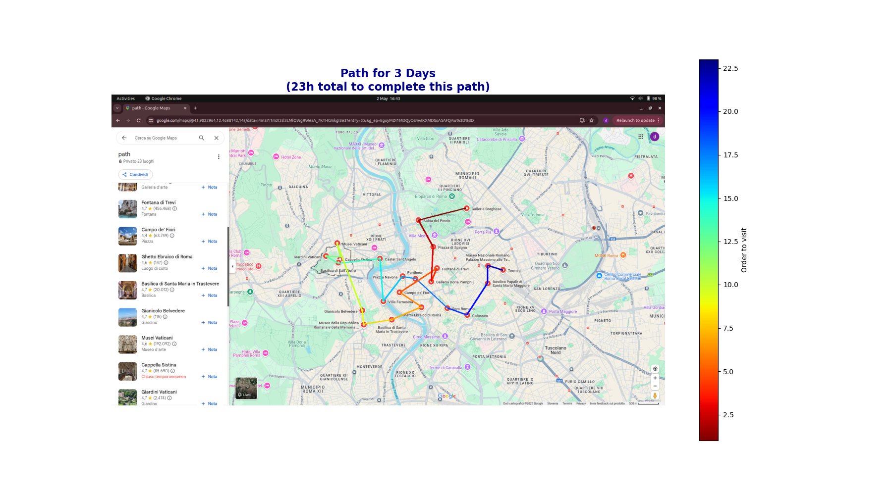
</p>

---

## ⚙️ How It Works

### 🔧 Input
- 🏙️ City: _Rome_  
- 📅 Number of days  
- 📍 Starting location (e.g., Termini Station)

### 🧠 Process
- Constructs a **weighted graph** of attractions  
- Filters out **temporarily closed** or inaccessible sites  
- Runs a **route optimization algorithm** with custom weights:
  - 🎨 Beauty of each place
  - ⌛ Visit time
  - 🚶 Walking distance  
- Computes total estimated time  
- Generates a **visual map** of the itinerary

### 📦 Output
- ✅ A **sorted list** of recommended places to visit  
- ⏳ Estimated **total visit time**  
- 🗺️ A **visual path** connecting all selected locations

---

### 🎫 Events and Concerts

The user can search for events specifying:

- City
- Dates
- Artist
- Music genre

The system connects to public website (e.g., **Bandsintown**) to show updated events.

---

### 🍽️ Restaurants and Local Food

- Suggests the **best restaurants** based on the area
- Recommends **typical dishes** based on location

---

### ☁️ Weather and Alerts

The weather module provides:

- **Detailed forecasts** for cities and dates
- **Automatic detection** of extreme events or abnormal conditions

---

### ✈️ Transport

The system provides up-to-date information on:

- Trains
- Buses

---

## ⚠️ Weaknesses

While the system is robust and flexible, it has some technical limitations that are currently being improved:

### 🚌 Train and Bus Search

- The transport website, if constantly queried, can **block automated traffic** detecting it as suspicious activity.
- In these cases, the search may fail or return incomplete results.

### 🌐 Article Translation

- Long articles may cause errors in the translation phase.
- The system splits texts into **individual sentences**, but sometimes **even a single sentence is too long** to be translated correctly.
- In these cases, the result is provided in the original language.

---

## 📌 Examples (Testing 01/05/2025)

### **User:**  
*Tell me the best typical food in Rome.*  

**Output**  
<p align="center">
  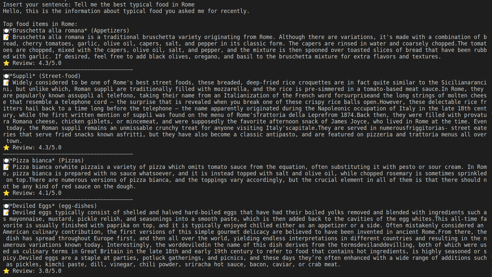
</p>

---


### **User:**  
*Can you recommend some places to visit in Valencia for 3 days?*  

**Output**  
<p align="center">
  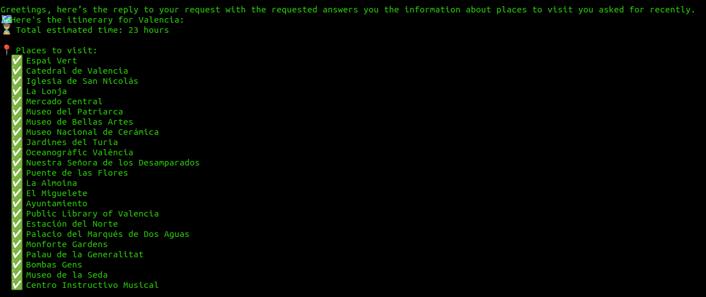
</p>

---


### **User:**  
*I would like to go in Rome for 3 days, can you reccomend for me the best things to visit?  Start to Termini Station*  

**Output**  
<p align="center">
  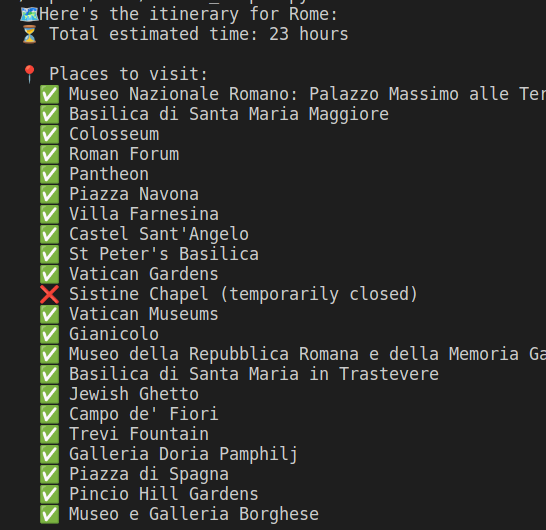
</p>

---

### **User:**  
*Hello, can you say me the current situation about the security in France, is safe?*  

**Output**  
<p align="center">
  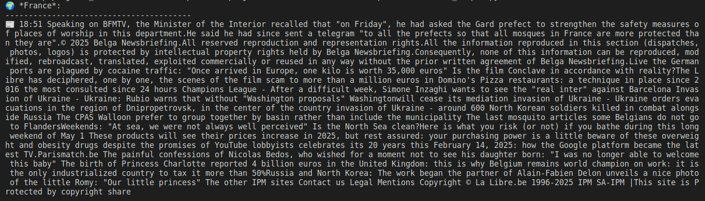
</p>
<p align="center">
  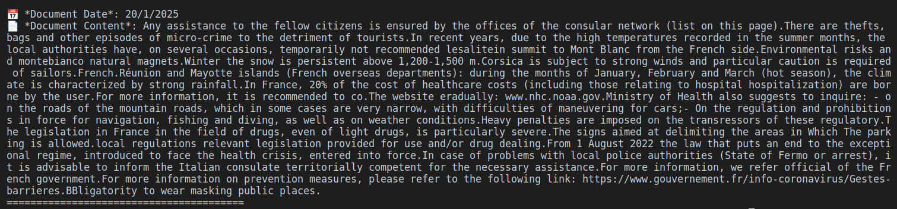
</p>


---

### **User:**  
*Tell me the last news about the warning weather alert in Valencia.*  

**Output**  
<p align="center">
  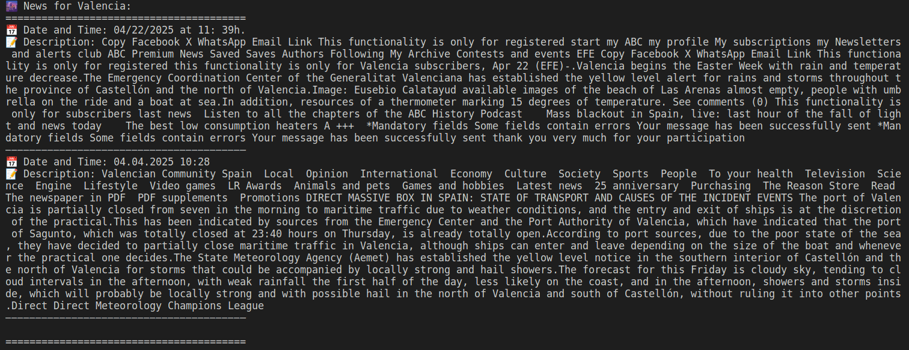
</p>

---

### **User:**  
*Some concerts in Ljubljana for tomorrow.*  

**Output**  
<p align="center">
  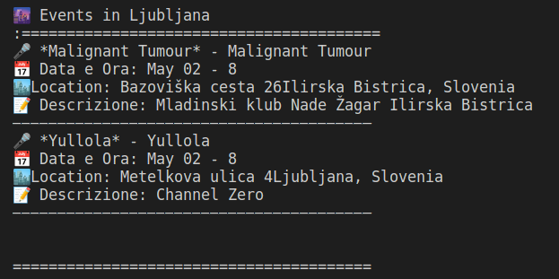
</p>

---

### **User:**  
*I am going in Milan in the 1 June, there are concert by Jerry Cantrell?*  

**Output**  
<p align="center">
  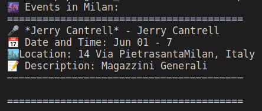
</p>

---

### **User:**  
*Can you write for me the best places where i can eat in Prague*  

**Output**  
<p align="center">
  
</p>

---

### **User:**  
*What are the typical food in Naples? and in Paris?*  

**Output**  
<p align="center">
  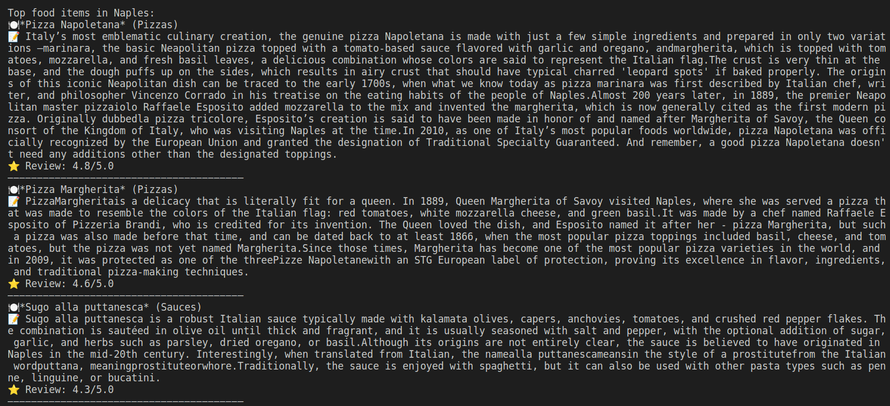
</p>
<p align="center">
  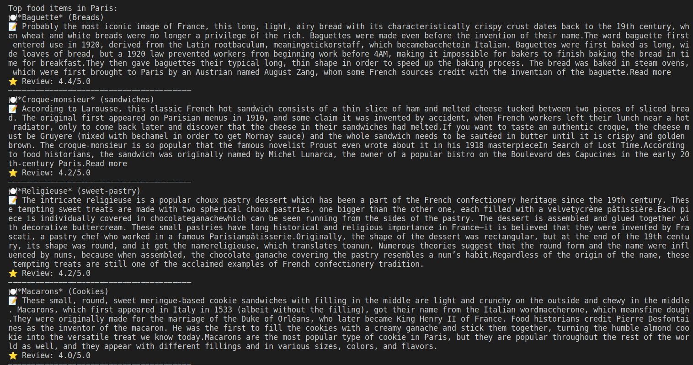
</p>


---

### **User:**  
*I am going in Berlin, tell me the temperature for friday.*  

**Output**  
<p align="center">
  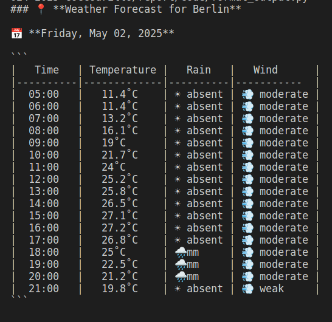
</p>

---
## 🔧 Technologies Used

- **Language:** Python `3.10+`
- **NLP Models:**  
  - `BERT` (for Question Answering and Named Entity Recognition)  
  - `MiniLM` (for intent classification)  
  - `BART` (for summarization and translation)

- **Main Libraries:**  
  - `transformers`, `sentence-transformers`  
  - `scikit-learn`, `networkx`, `geopy`  
  - `nltk`, `spacy`, `pandas`, `requests`  
  - `beautifulsoup4`, `selenium`

---

## ✅ Testing

The system has been tested using real-world natural language phrases to verify its reliability and effectiveness in real scenarios. Three main types of tests were conducted to assess various aspects of the system:

1. **Test on ambiguous and incomplete requests**  
   Examples with incomplete or ambiguous phrases were used to verify how the system handles request interpretation and the processing of missing information.  
   The results of these tests are available in the `testing/query_with_error_testing` folder.

2. **Intent classification test**  
   This test verified if the system can correctly classify the user intent, even in the presence of complex phrases or multiple intents.  
   The results of these tests are available in the `testing/intent_testing` folder.

3. **Real request and output test**  
   In this test, real examples of requests were used, executing a complete simulation from query formulation to the system-generated output. The goal was to evaluate the quality of the responses generated and the overall system reliability.  
   The results of these tests are available in the `testing/final_output_testing` folder.

### Testing Details:
- In some cases, **spelling errors** were deliberately introduced in the requests to test the system's ability to correct them automatically.
- Multiple cities or dates were also included in a single request to verify how the system handles complex scenarios.

These tests helped identify and fix any weaknesses, improving the overall system reliability.

## 📬 Contact

Do you have suggestions, bugs to report, or want to contribute?

👉 Open an issue or contact me directly on [Davide GitHub](https://github.com/davidebelcastro-sig) or [Ondrej GitHub](https://github.com/pritelo)

---
	 
	 
	 
	 
